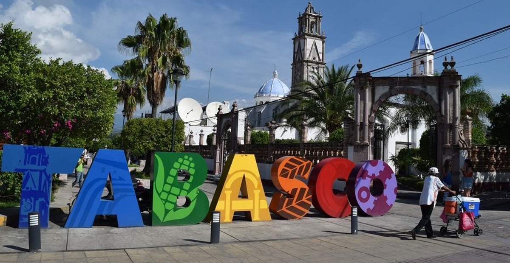
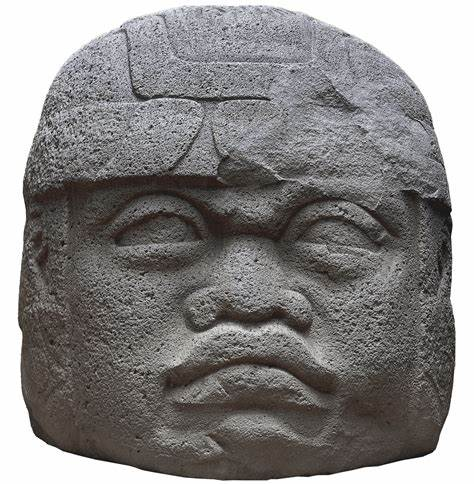
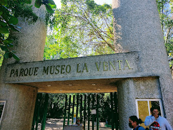
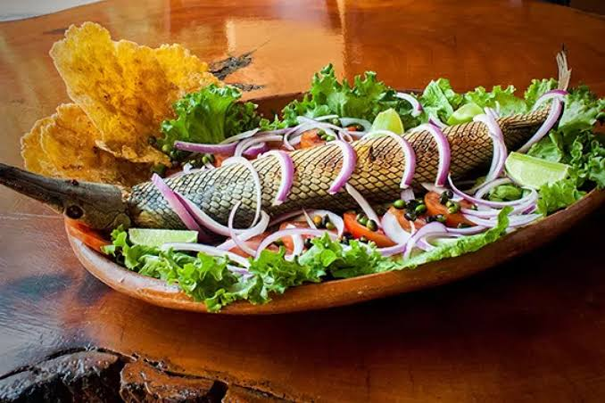
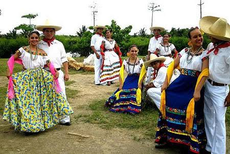

<html>
    <head>
        <meta name="description" content="Descubre la belleza y cultura de Tabasco">
        <meta name="keywords" content="Historia, Cultura, tradicciones y religiones, Gastronomía, Turismo">
        
        <title> Descubre Tabasco </title>
    </head>
    <body bgcolor="#d6d7c6" text="#000000">
        
<table width="950"><tr><td>
             
                  
             
              
             
                
            
<table border="0" width="90%" bgcolor="#fff7db">
                <tr>
                    <td colspan="2">
                        

                            <h1>Descubre la magia de Tabasco</h1> 
                            
Tabasco es un estado lleno de riquezas naturales, historia y cultura. Desde sus majestuosos ríos hasta su deliciosa gastronomía, hay mucho por descubrir.
               
                        
                        

                    </td>
                </tr>
                <tr>
                    <td>                            
                        <h1>Descubre a Tabasco</h1>
                        <h2>HISTORIA</h2>
                        
Tabasco tiene una historia fascinante, desde la cultura Olmeca, considerada la "madre de las civilizaciones mesoamericanas", hasta su papel en la época colonial y moderna.  

                        <h3>CULTURA, TRADICIONES Y RELIGIONES</h3>
                        <ul>
                            <li><b>Feria Tabasco:</b> El evento más importante del estado, con exposiciones, bailes y la elección de la Flor más Bella.</li>
                            <li><b>Danza del Pochó:</b> Baile tradicional de Tenosique que simboliza la lucha entre el bien y el mal.</li>
                            <li><b>Día de Muertos:</b> Se realizan altares con comida típica, flores y veladoras para honrar a los difuntos.</li>
                            <li><b>Carnaval de Villahermosa:</b> Celebración con desfiles y comparsas llenas de color y alegría.</li>
                        </ul>
                        
La mayoría de la población tabasqueña profesa el <b>catolicismo</b>, aunque en los últimos años ha habido un aumento en el cristianismo evangélico y otras creencias. Algunas comunidades indígenas aún practican rituales ancestrales.

                        <h4>GASTRONOMIA</h4>
                        
La comida tabasqueña es una de las más diversas de México. Algunos de sus platillos más conocidos son:

                        <ul>
                            <li><b>Pejelagarto asado:</b> Un pescado típico cocinado a la leña.</li>
                            <li><b>Tamal de chipilín:</b> Preparado con una hierba tradicional de la región.</li>
                            <li><b>Chirmol:</b> Carne en salsa espesa de chile.</li>
                            <li><b>Chocolate tabasqueño:</b> Bebida tradicional derivada del cacao.</li>
                        <h5>TURISMO</h5>
                        
El turismo en Tabasco ofrece una mezcla de naturaleza, historia y cultura. Algunos de los destinos más visitados son:

                        <ul>
                            <li><b>Parque-Museo La Venta:</b> Exhibe las famosas cabezas olmecas y esculturas prehispánicas.</li>
                            <li><b>Pantanos de Centla:</b> La mayor reserva de humedales en Mesoamérica, hogar de diversas especies.</li>
                            <li><b>Zona Arqueológica de Comalcalco:</b> La única ciudad maya construida con ladrillos de barro.</li>
                            <li><b>Río Usumacinta:</b> Ideal para paseos en lancha y actividades ecoturísticas.</li>
                        </ul>
                        
Integrantes:

                        
Melva Alondra Hernández de los Santos

                        
Karla Paola Hernández Gerónimo

                        
Blanca Saraí Montero Chable

                        
Reyna Judith Reyes Montero

                                                 
                    </td>
                    <td>
                        <blockquote class="twitter-tweet">
<a href="https://twitter.com/hashtag/Gastronom%C3%ADa?src=hash&amp;ref_src=twsrc%5Etfw">#Gastronomía</a> <a href="https://t.co/yNvAnEEX83">pic.twitter.com/yNvAnEEX83</a>
&mdash; smiling (@smiling413202) 
                            <a href="https://twitter.com/smiling413202/status/1898876824920400258?ref_src=twsrc%5Etfw">March 9, 2025</a></blockquote> 
                    </td>
                </tr>
            </table>

            
            

                <a href="index.html">Tabasco</a> -
                <a href="historia.html">Historia</a> -
                <a href="gastronomia.html">Gastronomía</a> -
                <a href="turismo.html"> Turismo</a> -
                <a href="contacto.html">Contáctanos</a>  
                 Copyright 2025 - Para más información, envíanos un mensaje a 
                <a href="infocobtabasco@gmail.com">infocobtabasco@gmail.com</a>
            

        </td></tr></table>

    </body>
</html> 

<!--
**Reyna24569/Reyna24569** is a ✨ _special_ ✨ repository because its `README.md` (this file) appears on your GitHub profile.

Here are some ideas to get you started:

- 🔭 I’m currently working on ...
- 🌱 I’m currently learning ...
- 👯 I’m looking to collaborate on ...
- 🤔 I’m looking for help with ...
- 💬 Ask me about ...
- 📫 How to reach me: ...
- 😄 Pronouns: ...
- ⚡ Fun fact: ...
-->
